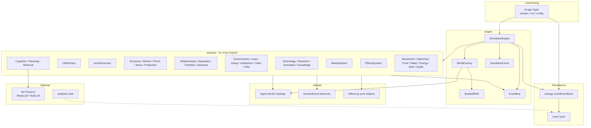

# Civitas Lab — Current State Audit

**Audit date:** 2026-07-23  
**Repository:** https://github.com/jponnam/Project-Genesis  
**Audited revision:** `ebc00ea62c08373e94b437fb312b938bc301c30a` (tip of `main` at audit time)  
**Package:** `civitas-lab` v0.1.0 (`src/civitas`)  
**Scope:** Read-only inspection of the repository, quality gates, CLI demo, and git/PR history.  
**Constraint honored:** No application code was modified, refactored, merged, or generated for this audit. This document is the only intentional deliverable.

---

## 1. PROJECT OVERVIEW

### What the application currently does

Civitas Lab is a **deterministic, event-sourced multi-agent simulation** written in Python. It creates a small world of agents that tick forward in discrete time steps. Each tick, agents experience need decay (food, water, energy, social, safety), choose actions via a utility policy (move, rest, gather, eat, drink, trade, produce, teach, research, etc.), and the engine records every meaningful change as a typed domain event.

The simulation is **not a game UI**. It is a research substrate: you configure a seed and population, run the engine, and get an append-only JSONL event log you can inspect or replay in code.

### Primary purpose

Provide a reproducible laboratory for studying emergent behavior in populations of autonomous agents—needs, economies, institutions, technology catalogs, knowledge diffusion, and cognition hooks—under clean-architecture constraints (domain independence, systems that do not import each other, event communication).

### What a user or researcher can do today

| Capability | Usable now? |
|---|---|
| Install with `uv` + editable package | Yes |
| Inspect config / fingerprint | Yes (`civitas config`) |
| Run deterministic simulations to JSONL | Yes (`civitas run`) |
| Replay JSONL event streams in Python via `JsonlEventStore` | Yes (library API; no CLI) |
| Run the full pytest suite / ruff check / mypy | Yes |
| Call a real LLM provider | No (Protocol + mock/null only) |
| Start an HTTP API | No |
| Open a dashboard / frontend | No |
| Offline analytics metrics package | Stub only (docstring package) |
| Auto-unlock late-phase techs/cities in a short default run | No — catalogs exist; default world seeds only fire + minimal civic seed |

### Implemented vs planned / partial

**Implemented (core):**

- Domain models, events, seeded RNG, clock, world factory, tick engine
- Needs + utility policy + action executor
- Geography, movement, gathering, food/water/energy, birth/death, population
- Economy, trading, markets, prices, production, taxes, wealth
- Relationships, trust, reputation, families, networks
- Governments, laws, voting, institutions, cities, infrastructure
- Technology / research / innovation / knowledge diffusion catalogs and systems
- Effect wiring (innovations, infra, laws, cities, institutions → action modifiers)
- Episodic memory, reflection, planning, retrieval (mock LLM)
- JSONL persistence + in-process replay reader
- Typer CLI: `version`, `run`, `config show`, `config fingerprint`

**Catalog-expanded but lightly exercised in default runs (Phases 9–20):**

- Large enums and helper stacks for techs, laws, institutions, infrastructure, cities (through Phase 20 glass/crystal)
- Effects compute when corresponding entities are active/discovered
- Default `WorldFactory` still seeds: **fire** discovered, **fire_hearth** active, **tax_schedule** law, **council** institution, **well** infrastructure, **settlement** capital city — not the late craft trees

**Planned / not implemented (README aspirational):**

- FastAPI, React, PostgreSQL, Redis, OpenTelemetry, real LLM SDKs, DuckDB/Polars, Temporal, Ray
- Dedicated analytics metrics implementation
- Replay CLI command
- Culture as a first-class subsystem (mentioned narratively; no `culture` module)

---

## 2. PHASE AND MILESTONE SUMMARY

Phases 1–20 are marked complete in `README.md`. Below: every milestone, what it added, primary artifacts, and merged PR. File paths are representative; most late milestones also touch `domain/effects.py`, observation events, and paired domain/system tests.

### Phase 1 — Foundation (PRs #1–#4, #6–#15; #5 was Cursor Cloud env)

| Milestone | What it added | Key artifacts | PR |
|---|---|---|---|
| M1 Project structure | Package layout under `src/civitas` | `src/civitas/`, `tests/`, `pyproject.toml` | #1 |
| M2 SimulationConfig | Immutable validated config + fingerprint | `domain/config.py` | #2 |
| M3 Typer CLI | `version`, `config` | `cli/app.py` | #3 |
| M4 Clock | Deterministic tick clock | `engine/clock.py` | #4 |
| M5 Agent models | Agent aggregate | `domain/agent.py` | #6 |
| M6 Events + bus | Domain events + in-memory bus | `domain/events.py`, `engine/event_bus.py` | #7 |
| M7 Seeded RNG | Deterministic RNG | `engine/rng.py` | #8 |
| M8 World factory | World bootstrap | `engine/world_factory.py` | #9 |
| M9 Needs | Need decay/restore | `systems/needs.py` | #10 |
| M10 Utility policy | Action scoring | `systems/policy.py` | #11 |
| M11 Action executor | Action application | `systems/actions.py` | #12 |
| M12 Simulation engine | Tick loop orchestration | `engine/simulation.py` | #13 |
| M13 JSONL storage | Append-only event store | `storage/jsonl.py` | #14 |
| M14 `civitas run` | End-to-end CLI run | `cli/app.py` | #15 |

### Phase 2 — Survival substrate (PRs #16–#24)

| Milestone | Added | Key files | PR |
|---|---|---|---|
| M1 Locations | Canonical map / locations | `domain/location.py`, `domain/geography.py` | #16 |
| M2 Movement | Move actions + costs | `systems/movement.py` | #17 |
| M3 Resource gathering | Gather from locations | `systems/gathering.py`, `domain/resources.py` | #18 |
| M4 Food | Eat / food needs | `systems/food.py`, `domain/food.py` | #19 |
| M5 Water | Drink / water needs | `systems/water.py`, `domain/water.py` | #20 |
| M6 Energy | Rest / energy | `systems/energy.py`, `domain/energy.py` | #21 |
| M7 Population | Census observations | `systems/population.py` | #22 |
| M8 Birth | Births | `systems/birth.py`, `domain/birth.py` | #23 |
| M9 Death | Deaths | `systems/death.py`, `domain/death.py` | #24 |

### Phase 3 — Economy (PRs #25–#31)

| Milestone | Added | Key files | PR |
|---|---|---|---|
| M1 Economy | Money / economic observations | `systems/economy.py`, `domain/economy.py` | #25 |
| M2 Trading | Peer trades | `systems/trading.py`, `domain/trading.py` | #26 |
| M3 Markets | Market listings | `systems/market.py`, `domain/market.py` | #27 |
| M4 Prices | Price observations | `systems/prices.py`, `domain/prices.py` | #28 |
| M5 Production | Produce action | `systems/production.py`, `domain/production.py` | #29 |
| M6 Taxes | Tax collection | `systems/taxes.py`, `domain/taxes.py` | #30 |
| M7 Wealth | Wealth observations | `domain/wealth.py` | #31 |

### Phase 4 — Social (PRs #32–#36)

| Milestone | Added | Key files | PR |
|---|---|---|---|
| M1 Relationships | Relationship graph | `systems/relationships.py` | #32 |
| M2 Trust | Trust values / gating later | `domain/relationships.py` | #33 |
| M3 Reputation | Reputation tracking | `systems/reputation.py` | #34 |
| M4 Families | Family structures | `systems/families.py` | #35 |
| M5 Social networks | Network observations | `systems/networks.py` | #36 |

### Phase 5 — Governance & settlement (PRs #37–#42)

| Milestone | Added | Key files | PR |
|---|---|---|---|
| M1 Governments | Government entities + treasury later | `systems/governments.py` | #37 |
| M2 Laws | Law kinds + activation | `systems/laws.py`, `domain/laws.py` | #38 |
| M3 Voting | Elections | `systems/voting.py` | #39 |
| M4 Institutions | Institution kinds | `systems/institutions.py` | #40 |
| M5 Cities | City kinds / seats | `systems/cities.py`, `domain/cities.py` | #41 |
| M6 Infrastructure | Infra kinds / wells etc. | `systems/infrastructure.py` | #42 |

### Phase 6 — Knowledge economy (PRs #43–#46)

| Milestone | Added | Key files | PR |
|---|---|---|---|
| M1 Technology | Tech catalog + discovery | `systems/technology.py`, `domain/technology.py` | #43 |
| M2 Research | Research progress (pottery path) | `systems/research.py`, `domain/research.py` | #44 |
| M3 Innovation | Innovation activation | `systems/innovation.py`, `domain/innovation.py` | #45 |
| M4 Knowledge diffusion | Fact spread among agents | `systems/knowledge.py`, `domain/knowledge.py` | #46 |

### Phase 7 — Cognition (PRs #47–#50)

| Milestone | Added | Key files | PR |
|---|---|---|---|
| M1 Memory encoding + LLM port | Episodic memory + `llm` Protocol | `domain/memory.py`, `llm/` | #47 |
| M2 Reflection | Seeded mock LLM reflection | `systems/cognition.py`, `domain/reflection.py` | #48 |
| M3 Planning | Goals from beliefs | `systems/planning.py`, `domain/planning.py` | #49 |
| M4 Memory retrieval | Working memory retrieval | `systems/retrieval.py`, `domain/retrieval.py` | #50 |

### Phase 8 — Effect wiring (PRs #51–#54)

| Milestone | Added | Key files | PR |
|---|---|---|---|
| M1 Effect wiring | Innovation effects on REST/GATHER | `domain/effects.py`, `systems/effects.py` | #51 |
| M2 Infrastructure effects | Well → drink restore | `domain/effects.py` | #52 |
| M3 Birth knowledge | Parental fact inheritance | `systems/birth.py` | #53 |
| M4 Trust-gated teaching | Teach gated by trust | `systems/knowledge.py` / policy | #54 |

### Phase 9 — Tech trees & civic depth (PRs #55–#66)

| M | Added | PR |
|---|---|---|
| 1 | Technology prerequisite trees | #55 |
| 2 | Irrigation technology (requires pottery) | #56 |
| 3 | Tax → government treasuries | #57 |
| 4 | Institution budgets from treasuries | #58 |
| 5 | Treasury-funded infrastructure construction | #59 |
| 6 | Storehouse infrastructure (food gather bonus) | #60 |
| 7 | Road infrastructure (move energy discount) | #61 |
| 8 | Institution-funded infrastructure construction | #62 |
| 9 | Guild institutions (produce discount) | #63 |
| 10 | Market fee laws | #64 |
| 11 | Outpost cities | #65 |
| 12 | Metallurgy technology | #66 |

**Primary modules:** `domain/technology.py`, `domain/effects.py`, `systems/taxes.py`, `systems/infrastructure.py`, `systems/institutions.py`, `systems/laws.py`, `systems/cities.py`, matching `tests/domain` + `tests/systems`.

### Phase 10 — Writing & institutional memory (PRs #67–#78)

Writing → Archive → Scriptorium → Curriculum → Library → Bureaucracy → Mathematics → Academy → Observatory → Astronomy → Calendar → Forum.  
Effects center on teaching/retrieval bonuses and market-fee reductions. PRs #67–#78.

### Phase 11 — Philosophy & reflective culture (PRs #79–#90)

Philosophy → Ethics → Temple → Shrine → Sanctuary → School → Logic → Lyceum → Stoa → Rhetoric → Assembly → Agora.  
Rest/drink/teach/socialize/retrieval bonuses. PRs #79–#90.

### Phase 12 — Medicine & public health (PRs #91–#102)

Medicine → Sanitation → Hospital → Clinic → Infirmary → Apothecary → Anatomy → Collegium → Bathhouse → Hygiene → Quarantine → Lazaretto.  
Rest/drink/teach bonuses. PRs #91–#102.

### Phase 13 — Engineering & construction (PRs #103–#114)

Engineering → Building codes → Workshop → Bridge → Foundry → Mason → Architecture → Architect → Scaffold → Surveying → Zoning → Quarry.  
Produce/move/gather/teach/retrieval/eat modifiers. PRs #103–#114.

### Phase 14 — Navigation & trade routes (PRs #115–#126)

Navigation → Passage → Caravan → Waystation → Harbor → Merchant → Cartography → Cartographer → Beacon → Seafaring → Customs → Entrepot.  
Move/market/gather/retrieval bonuses. PRs #115–#126.

### Phase 15 — Agriculture & husbandry (PRs #127–#138)

Agriculture → Land tenure → Granary → Ditch → Farmstead → Husbandman → Crop rotation → Agronomist → Terrace → Forestry → Conservation → Pastoral.  
Food/wood gather and eat restore. PRs #127–#138.

### Phase 16 — Textiles & craft goods (PRs #139–#150)

Textiles → Labor → Weaver → Fulling mill → Mill town → Dyer → Dyeing → Tailor → Warehouse → Tanning → Sumptuary → Emporium.  
Produce and market-fee stacks. PRs #139–#150.

### Phase 17 — Mining & minerals (PRs #151–#162)

Mining → Mineral rights → Miner → Mineshaft → Mining camp → Smelter → Smithing → Smith → Forge works → Toolmaking → Safety codes → Ironworks.  
Stone gather + produce stacks. PRs #151–#162.

### Phase 18 — Timber & carpentry (PRs #163–#174)

Carpentry → Timber rights → Woodcutter → Lumber yard → Timber town → Joiner → Joinery → Carver → Sawpit → Cabinetry → Forest management → Guildhall.  
Wood gather + produce + teaching. PRs #163–#174.

### Phase 19 — Ceramics & kilncraft (PRs #175–#186)

Ceramics → Firing codes → Potter → Kiln yard → Pottery town → Glazer → Glazing → Tilewright → Clay pit → Porcelain → Clay codes → Kiln quarter.  
Produce discounts + teaching. PRs #175–#186.

### Phase 20 — Glass and glasscraft (PRs #187–#198)

**Correction vs user wording:** Milestone 9 is **Lehr infrastructure**, not “Lehr institutions.” Optician is the teaching-bonus institution in this phase.

| M | Name | What it added | Main implementation | Tests | PR |
|---|---|---|---|---|---|
| **M1** | **Glassmaking** | `TechnologyKind.GLASSMAKING`; innovation `BLOWPIPE`; global produce-energy discount when active | `domain/technology.py`, `domain/innovation.py`, `domain/research.py`, `domain/effects.py` | `tests/domain/test_technology.py`, `test_innovation.py`, `test_effects.py`, systems counterparts | [#187](https://github.com/jponnam/Project-Genesis/pull/187) |
| **M2** | **Annealing codes** | `LawKind.ANNEALING_CODES`; subject-scoped PRODUCE energy discount | `domain/laws.py`, `domain/effects.py`, `systems/laws.py` | `tests/domain/test_laws.py`, `tests/systems/test_laws.py`, effects tests | [#188](https://github.com/jponnam/Project-Genesis/pull/188) |
| **M3** | **Glassblower institutions** | `InstitutionKind.GLASSBLOWER`; seat produce discount | `domain/institutions.py`, `domain/effects.py` | institution + effects tests | [#189](https://github.com/jponnam/Project-Genesis/pull/189) |
| **M4** | **Glasshouse infrastructure** | `InfrastructureKind.GLASSHOUSE`; produce discount | `domain/infrastructure.py`, `domain/effects.py` | infra + effects tests | [#190](https://github.com/jponnam/Project-Genesis/pull/190) |
| **M5** | **Glassworks cities** | `CityKind.GLASSWORKS`; resident produce discount (stacks with prior chain) | `domain/cities.py`, `domain/effects.py` | city + effects tests | [#191](https://github.com/jponnam/Project-Genesis/pull/191) |
| **M6** | **Lensmaker institutions** | `InstitutionKind.LENSMAKER`; produce discount | `domain/institutions.py`, `domain/effects.py` | institution + effects tests | [#192](https://github.com/jponnam/Project-Genesis/pull/192) |
| **M7** | **Optics and lenses** | `TechnologyKind.OPTICS`; innovation `LENS`; produce discount | `domain/technology.py`, `domain/innovation.py`, `domain/effects.py` | tech/innovation/effects tests | [#193](https://github.com/jponnam/Project-Genesis/pull/193) |
| **M8** | **Optician institutions and teachings** | `InstitutionKind.OPTICIAN`; **teachings-per-knower bonus** at seat (not produce) | `domain/institutions.py`, `domain/effects.py` (`effective_teachings_per_knower`) | institution + effects + knowledge-adjacent tests | [#194](https://github.com/jponnam/Project-Genesis/pull/194) |
| **M9** | **Lehr infrastructure** | `InfrastructureKind.LEHR`; produce discount (annealing oven infra) | `domain/infrastructure.py`, `domain/effects.py` | infra + effects tests | [#195](https://github.com/jponnam/Project-Genesis/pull/195) |
| **M10** | **Crystal production** | `TechnologyKind.CRYSTAL`; innovation `FACET`; produce discount | `domain/technology.py`, `domain/innovation.py`, `domain/effects.py` | tech/innovation/effects tests | [#196](https://github.com/jponnam/Project-Genesis/pull/196) |
| **M11** | **Crystal codes** | `LawKind.CRYSTAL_CODES`; produce discount | `domain/laws.py`, `domain/effects.py` | laws + effects tests | [#197](https://github.com/jponnam/Project-Genesis/pull/197) |
| **M12** | **Crystal quarter cities** | `CityKind.CRYSTAL_QUARTER`; resident produce discount stacking with glassworks chain; closes Phase 20 | `domain/cities.py`, `domain/effects.py`, `README.md` current milestone | city + effects tests | [#198](https://github.com/jponnam/Project-Genesis/pull/198) |

**Phase 20 catalog counts after merge (enums):** TechnologyKind 37 · LawKind 24 · InstitutionKind 35 · InfrastructureKind 25 · CityKind 24.

---

## 3. CURRENT ARCHITECTURE

### Complete folder structure (source-relevant)

```text
.
├── LICENSE
├── README.md
├── pyproject.toml
├── docs/
│   └── CURRENT_STATE_AUDIT.md          # this audit (only new doc)
├── runs/                               # gitignored JSONL outputs
├── src/civitas/
│   ├── __init__.py
│   ├── analytics/                      # stub package (docstring only)
│   │   └── __init__.py
│   ├── cli/                            # Typer entrypoints
│   │   ├── __init__.py
│   │   └── app.py
│   ├── domain/                         # models, catalogs, pure helpers
│   │   ├── actions.py, agent.py, attributes.py, birth.py, cities.py
│   │   ├── config.py, death.py, economy.py, effects.py, energy.py
│   │   ├── events.py, families.py, food.py, geography.py, governments.py
│   │   ├── ids.py, infrastructure.py, innovation.py, institutions.py
│   │   ├── knowledge.py, laws.py, location.py, market.py, memory.py
│   │   ├── networks.py, numeric.py, planning.py, population.py, prices.py
│   │   ├── production.py, reflection.py, relationships.py, reputation.py
│   │   ├── research.py, resources.py, retrieval.py, taxes.py, technology.py
│   │   ├── time.py, trading.py, types.py, voting.py, water.py, wealth.py
│   │   └── world.py
│   ├── engine/                         # clock, RNG, bus, factory, loop
│   │   ├── clock.py, event_bus.py, rng.py, simulation.py, world_factory.py
│   ├── llm/                            # Protocol + Mock + Null adapters
│   │   ├── protocol.py, mock.py, null.py
│   ├── storage/                        # JSONL persist + replay reader
│   │   └── jsonl.py
│   └── systems/                        # tick-phase behaviors (no cross-imports)
│       ├── actions.py, birth.py, cities.py, cognition.py, death.py
│       ├── economy.py, effects.py, energy.py, families.py, food.py
│       ├── gathering.py, governments.py, infrastructure.py, innovation.py
│       ├── institutions.py, knowledge.py, laws.py, market.py, movement.py
│       ├── needs.py, networks.py, planning.py, policy.py, population.py
│       ├── prices.py, production.py, relationships.py, reputation.py
│       ├── research.py, retrieval.py, taxes.py, technology.py, trading.py
│       ├── voting.py, water.py
└── tests/
    ├── cli/, domain/, engine/, llm/, storage/, systems/
    └── test_package_structure.py
```

(~190 Python files under `src/` + `tests/`; 98 mypy-checked source files in `src`.)

### Major directories

| Directory | Role |
|---|---|
| `src/civitas/domain` | Pure domain: aggregates, value objects, catalogs, effect helpers, events. No Civitas outward deps. |
| `src/civitas/engine` | Orchestration: seeded RNG, clock, event bus, world factory, `SimulationEngine` tick loop. |
| `src/civitas/systems` | One concern per module; mutate world / emit events; **must not import other systems**. |
| `src/civitas/storage` | Append-only JSONL write + sequential replay read. |
| `src/civitas/analytics` | Placeholder for offline metrics (not implemented). |
| `src/civitas/llm` | Optional cognition port; mock/null only. |
| `src/civitas/cli` | Thin Typer adapter over config + engine + storage. |
| `tests/` | Mirrors package layout; strict pytest (`filterwarnings = error`). |
| `runs/` | Default/local simulation outputs (gitignored). |
| `docs/` | Audit documentation. |

### Application entry points

1. **Console script:** `civitas` → `civitas.cli.app:main` (`pyproject.toml` `[project.scripts]`)
2. **Library:** `SimulationEngine().run(SimulationConfig(...))` → `SimulationResult` with `world` + `events`
3. **Storage helper:** `civitas.storage.write_events` / `JsonlEventStore.read_all`

There is **no** `__main__.py` API server, ASGI app, or frontend entrypoint.

### How layers interact

1. CLI validates options into `SimulationConfig`.
2. Engine creates world via `WorldFactory`, observes baseline systems, then for each tick: emit `TickStarted` → needs/policy/actions/domain systems → `TickCompleted`.
3. Systems read world state and domain helpers (`effects`, catalogs); emit `DomainEvent`s on the bus; return updated immutable-ish world snapshots.
4. Storage serializes the event tuple to JSONL.
5. Analytics is intended to read JSONL offline but currently has no implementation.
6. Tests construct configs/worlds/systems directly; CLI tests invoke Typer.

### Mermaid architecture diagram



---

## 4. FEATURE INVENTORY

| Feature | Status | Phase | Main implementation files | Tests | How to run / observe |
|---|---|---|---|---|---|
| Simulation engine | **Implemented** | 1 | `engine/simulation.py`, `clock.py`, `event_bus.py` | `tests/engine/test_simulation.py` | `civitas run ...` |
| Seeded RNG / determinism | **Implemented** | 1 | `engine/rng.py`, `domain/config.py` | `tests/engine/test_rng.py`, CLI fingerprint | `--seed 42`; compare fingerprints |
| Agents | **Implemented** | 1 | `domain/agent.py` | `tests/domain/test_agent.py` | Spawn events in JSONL |
| Needs & decisions | **Implemented** | 1 | `systems/needs.py`, `systems/policy.py` | `test_needs.py`, `test_policy.py` | NeedDecayed / ActionSelected events |
| Action execution | **Implemented** | 1 | `systems/actions.py` | `tests/systems/test_actions.py` | ActionCompleted events |
| Locations / movement | **Implemented** | 2 | `domain/location.py`, `systems/movement.py` | movement/location tests | AgentMoved events |
| Resources / gathering | **Implemented** | 2 | `systems/gathering.py`, `domain/resources.py` | gathering/resources tests | Gather actions (longer runs) |
| Food / water / energy | **Implemented** | 2 | `systems/food.py`, `water.py`, `energy.py` | matching system tests | Eat/drink/rest actions |
| Population / birth / death | **Implemented** | 2 | `systems/population.py`, `birth.py`, `death.py` | matching tests | Longer runs / unit tests |
| Economy / wealth | **Implemented** | 3 | `systems/economy.py`, `domain/wealth.py` | economy/wealth tests | WealthObserved; agent.money |
| Trading / markets / prices | **Implemented** | 3 | `systems/trading.py`, `market.py`, `prices.py` | matching tests | MarketObserved / trade events |
| Production | **Implemented** | 3 | `systems/production.py` | `test_production.py` | Produce action + effect discounts |
| Taxes / treasury | **Implemented** | 3/9 | `systems/taxes.py`, governments | taxes/gov tests | Government.treasury |
| Relationships / trust / reputation | **Implemented** | 4 | `systems/relationships.py`, `reputation.py` | matching tests | *Observed events |
| Families / networks | **Implemented** | 4 | `systems/families.py`, `networks.py` | matching tests | *Observed events |
| Governments / laws / voting | **Implemented** | 5 | `systems/governments.py`, `laws.py`, `voting.py` | matching tests | Seeded council + tax_schedule |
| Institutions / cities / infrastructure | **Implemented** | 5+ | domain + systems modules | extensive domain/system tests | Default: council, settlement, well |
| Technology / research / innovation | **Implemented** | 6+ | `technology.py`, `research.py`, `innovation.py` + systems | matching tests | 37 techs catalogued; fire discovered by default |
| Knowledge diffusion / teaching | **Implemented** | 6/8 | `systems/knowledge.py`, effects teaching helpers | knowledge tests | Teach actions; trust gating |
| Effect wiring stacks | **Implemented** | 8–20 | `domain/effects.py` | `test_effects.py` | Unit tests with constructed worlds |
| Memory / reflection / planning / retrieval | **Implemented** | 7 | cognition/planning/retrieval systems + domain | matching tests | MemoryRecorded, AgentReflected, PlanUpdated, MemoryRetrieved |
| Event sourcing | **Implemented** | 1 | `domain/events.py`, bus, JSONL | `tests/domain/test_events.py`, storage tests | Every run writes JSONL |
| Replay | **Partial** | 1 | `JsonlEventStore.read_all` / `iter_events` | `tests/storage/test_jsonl.py` | Library only — no `civitas replay` |
| Analytics | **Stub** | — | `analytics/__init__.py` (7 lines) | none | N/A |
| CLI tools | **Implemented** | 1 | `cli/app.py` | `tests/cli/test_app.py` | `civitas --help` |
| APIs | **Not implemented** | planned | — | — | — |
| Dashboards / visualization | **Not implemented** | planned | — | — | — |
| LLM functionality | **Mock only** | 7 | `llm/protocol.py`, `mock.py`, `null.py` | `tests/llm/test_mock.py` | Used inside cognition with seeded mock |
| Culture subsystem | **Not a module** | narrative | city copy mentions “reflective culture” | — | No dedicated culture feature |
| Phase 20 glass/crystal catalogs | **Implemented in catalog + effects** | 20 | tech/laws/institutions/infra/cities/effects | domain/system tests per PR | Construct entities in tests; not auto-seeded in short CLI runs |

---

## 5. RUNNING THE PROJECT

Commands below are taken from `README.md`, `pyproject.toml`, and verified against the installed console script.

### Install dependencies

```bash
# Requires uv (https://docs.astral.sh/uv/)
uv python install 3.14
uv venv --python 3.14 .venv
source .venv/bin/activate
uv pip install -e ".[dev]"
```

(On this audit environment the venv already exists; equivalent invocation used: `.venv/bin/pytest`, `.venv/bin/civitas`, etc.)

### Activate the environment

```bash
source .venv/bin/activate
```

### Main application / sample simulation

```bash
civitas version
civitas run --seed 42 --ticks 100 --agents 10 --name default
civitas run --seed 42 --ticks 20 --agents 5 -o runs/demo.jsonl
```

Default output path when `-o` omitted: `runs/<name>_seed<seed>.jsonl`.

### List CLI commands

```bash
civitas --help
civitas config --help
```

Commands present: `version`, `run`, `config show`, `config fingerprint`.

### API server

**None configured.** No FastAPI/Flask/Django app, no Docker Compose service.

### Frontend / dashboard

**None configured.**

### Tests

```bash
pytest
# or
.venv/bin/pytest
.venv/bin/pytest -q
.venv/bin/pytest --cov=civitas
```

(`pyproject.toml`: `testpaths = ["tests"]`, `pythonpath = ["src"]`, `fail_under = 80` for coverage.)

### Ruff

```bash
ruff check src tests
ruff format --check src tests
```

### mypy

README lists bare `mypy`. Verified working forms:

```bash
mypy
mypy src
```

(`tool.mypy` sets `packages = ["civitas"]`, `mypy_path = "src"`.)

### Replay an existing simulation

No CLI replay command. Library usage:

```bash
.venv/bin/python - <<'PY'
from civitas.storage import JsonlEventStore
store = JsonlEventStore("runs/audit_demo_seed42.jsonl")
events = store.read_all()
print(len(events), type(events[0]).__name__, type(events[-1]).__name__)
PY
```

### Inspect generated output

```bash
ls -la runs/
wc -l runs/<file>.jsonl
head -n 3 runs/<file>.jsonl
```

Events are JSON lines with typed payloads (Pydantic-serialized domain events).

---

## 6. LIVE DEMONSTRATION

Safe deterministic demo using the supported CLI. **Did not delete or overwrite prior user data** (`runs/` was empty/gitignored before this audit file was written).

### Command executed

```bash
.venv/bin/civitas run --seed 42 --ticks 5 --agents 3 --name audit_demo -o runs/audit_demo_seed42.jsonl
```

### Seed and configuration

| Field | Value |
|---|---|
| seed | `42` |
| ticks | `5` |
| agent_count | `3` |
| run_name | `audit_demo` |
| fingerprint | `seed=42|ticks=5|agents=3|name=audit_demo` |

Confirmed via:

```bash
.venv/bin/civitas config show --seed 42 --ticks 5 --agents 3 --name audit_demo
.venv/bin/civitas config fingerprint --seed 42 --ticks 5 --agents 3 --name audit_demo
```

### Initial state (from events + world factory defaults)

- `SimulationStarted` (seed=42, ticks=5, agents=3)
- 9 `LocationCreated` (canonical map)
- Full technology/innovation catalogs emitted (`TechnologyCreated`×37, `InnovationCreated`×37)
- Civic seed: market, government (“Camp Authority”), law `tax_schedule`, institution `council`, infrastructure `well`, city `settlement` (“Camp City”)
- 3 agents spawned at location 0: `Agent-0`, `Agent-1`, `Agent-2`
- Only **fire** discovered; only **fire_hearth** innovation active

### Major events produced (447 total)

| Event type | Count |
|---|---|
| NeedDecayed | 90 |
| TechnologyCreated | 37 |
| InnovationCreated | 37 |
| MemoryRecorded | 30 |
| ActionSelected / ActionCompleted | 15 / 15 |
| AgentReflected / PlanUpdated / MemoryRetrieved | 15 each |
| AgentMoved | 11 |
| LocationCreated | 9 |
| Per-tick observation family (*Observed) | 6 each of many domains |
| TickStarted / TickCompleted | 5 / 5 |
| ResearchProgressed | 5 |
| AgentSpawned | 3 |
| SimulationStarted / SimulationCompleted | 1 / 1 |

**Actions chosen:** `move`×11, `rest`×4 (no gather/trade/produce in this 5-tick micro-run).

### Final state (recomputed via `SimulationEngine().run` — identical seed)

| Agent | Location | Money | Needs (food/water/energy/social/safety) | Knowledge |
|---|---|---|---|---|
| Agent-0 | 3 | 19 | 0.9 / 0.85 / 1.0 / 0.95 / 0.975 | `{fire}` |
| Agent-1 | 6 | 7 | 0.9 / 0.85 / 0.85 / 0.95 / 0.975 | `{fire}` |
| Agent-2 | 6 | 2 | 0.9 / 0.85 / 0.85 / 0.95 / 0.975 | `{fire}` |

- Government treasury: **0**
- Laws active: `tax_schedule`
- Institutions: `council`
- Infrastructure: `well`
- Cities: `settlement` / Camp City
- Inventories empty

### Generated files

- `runs/audit_demo_seed42.jsonl` — **112,958 bytes**, 447 events  
- Path is gitignored (`runs/` in `.gitignore`)

### Analytics / metrics

No analytics CLI. Manual counts above from event stream. Package `civitas.analytics` is a stub.

### Replay result

```text
replay_count 447
first SimulationStarted ...
last  SimulationCompleted sequence=446 tick=5 ticks_executed=5
```

`JsonlEventStore.read_all()` successfully reconstituted the full typed event tuple.

---

## 7. TEST AND QUALITY STATUS

Executed on commit `ebc00ea` with `.venv` tools.

| Check | Exact command | Result | Time |
|---|---|---|---|
| Ruff lint | `.venv/bin/ruff check src tests` | **Pass** — all checks passed | ~0.01s |
| Ruff format | `.venv/bin/ruff format --check src tests` | **Fail** — 20 files would be reformatted | ~0.02s |
| mypy | `.venv/bin/mypy src` (also bare `mypy`) | **Pass** — 98 source files | ~0.14s |
| pytest | `.venv/bin/pytest -q` | **1240 passed**, 0 failed, 0 skipped | **7.17s** (wall ~7.42s) |
| coverage | `.venv/bin/pytest -q --cov=civitas` | **89.60%** total (fail_under 80) | ~8.46s |

**Format-check offenders (sample):** `domain/cities.py`, `effects.py`, `infrastructure.py`, `knowledge.py`, `laws.py`, `technology.py`, `world.py`, and several tests under `tests/domain` / `tests/systems`.

### Can the claimed 1,240 passing tests be reproduced from current main?

**Yes.** On `ebc00ea` (Phase 20 M12 / PR #198 tip of main):

```text
1240 passed in 7.17s
```

No skipped tests in the quiet run. Pytest is configured with `filterwarnings = ["error"]`.

**Caveat:** README’s quality gate list claims all four of pytest / ruff check / ruff format / mypy must pass for a milestone to be complete; **`ruff format --check` currently fails on main**, so the repo does not fully satisfy its own published gate set even though lint + types + tests pass.

---

## 8. GIT HISTORY

| Item | Value |
|---|---|
| Audit working branch | `cursor/current-state-audit-d6c5` (branched from main for this doc only) |
| Audited main tip | `ebc00ea62c08373e94b437fb312b938bc301c30a` |
| Latest commit subject | Phase 20 Milestone 12: add crystal quarter cities with produce discount (#198) |
| Commit count | 238 |
| Tags / releases | **None** |
| Uncommitted app changes at audit start | Clean tree on main |
| Merged PRs | **198** (`gh pr list --state merged`) |

### Latest 30 commits (newest first)

```text
ebc00ea Phase 20 Milestone 12: add crystal quarter cities with produce discount (#198)
32c3581 Phase 20 Milestone 11: add crystal codes laws with produce discount (#197)
942abf9 Phase 20 Milestone 10: add crystal technology with facet produce discount (#196)
b43378f Phase 20 Milestone 9: add lehr infrastructure with produce discount (#195)
06cfb08 Phase 20 Milestone 8: add optician institutions with teaching bonus (#194)
03d4089 Phase 20 Milestone 7: add optics technology with lens produce discount (#193)
8696531 Phase 20 Milestone 6: add lensmaker institutions with produce discount (#192)
08b1f77 Phase 20 Milestone 5: add glassworks cities with produce discount (#191)
97c68be Phase 20 Milestone 4: add glasshouse infrastructure with produce discount (#190)
0bbec91 Phase 20 Milestone 3: add glassblower institutions with produce discount (#189)
eb6c545 Phase 20 Milestone 2: add annealing codes laws with produce discount (#188)
71ffc24 Phase 20 Milestone 1: add glassmaking technology with blowpipe produce discount (#187)
ba6a104 Phase 19 Milestone 12: add kiln quarter cities with produce discount (#186)
7fb800b Phase 19 Milestone 11: add clay codes laws with produce discount (#185)
7800afe Phase 19 Milestone 10: add porcelain technology with kaolin produce discount (#184)
750c123 Phase 19 Milestone 9: add clay pit infrastructure with produce discount (#183)
cf793ff Phase 19 Milestone 8: add tilewright institutions with teaching bonus (#182)
b9831b9 Phase 19 Milestone 7: add glazing technology with glaze produce discount (#181)
1e5466c Phase 19 Milestone 6: add glazer institutions with produce discount (#180)
91f98aa Phase 19 Milestone 5: add pottery town cities with produce discount (#179)
ef81d53 Phase 19 Milestone 4: add kiln yard infrastructure with produce discount (#178)
186ec02 Phase 19 Milestone 3: add potter institutions with produce discount (#177)
7b6368d Phase 19 Milestone 2: add firing codes laws with produce discount (#176)
2203fb4 Phase 19 Milestone 1: add ceramics technology with kiln produce discount (#175)
5b95d09 Phase 18 Milestone 12: add guildhall cities with produce discount (#174)
c6f4d3f Phase 18 Milestone 11: add forest management laws boosting wood gather (#173)
74d5d4f Phase 18 Milestone 10: add cabinetry technology with dovetail produce discount (#172)
76b9451 Phase 18 Milestone 9: add sawpit infrastructure with produce discount (#171)
20fd187 Phase 18 Milestone 8: add carver institutions with teaching bonus (#170)
3815477 Phase 18 Milestone 7: add joinery technology with plane produce discount (#169)
```

### Merged PR volume by phase

| Phase | Merged PRs |
|---|---|
| 1 | 14 (+ env PR #5) |
| 2 | 9 |
| 3 | 7 |
| 4 | 5 |
| 5 | 6 |
| 6 | 4 |
| 7 | 4 |
| 8 | 4 |
| 9–20 | 12 each |

### Phase 20 PRs #187–#198

| PR | Title | Merged (UTC) | URL |
|---|---|---|---|
| #187 | Glassmaking / blowpipe produce discount | 2026-07-23T02:47:18Z | https://github.com/jponnam/Project-Genesis/pull/187 |
| #188 | Annealing codes laws | 2026-07-23T02:49:44Z | https://github.com/jponnam/Project-Genesis/pull/188 |
| #189 | Glassblower institutions | 2026-07-23T02:51:54Z | https://github.com/jponnam/Project-Genesis/pull/189 |
| #190 | Glasshouse infrastructure | 2026-07-23T02:53:57Z | https://github.com/jponnam/Project-Genesis/pull/190 |
| #191 | Glassworks cities | 2026-07-23T02:56:17Z | https://github.com/jponnam/Project-Genesis/pull/191 |
| #192 | Lensmaker institutions | 2026-07-23T02:58:58Z | https://github.com/jponnam/Project-Genesis/pull/192 |
| #193 | Optics / lens | 2026-07-23T03:03:45Z | https://github.com/jponnam/Project-Genesis/pull/193 |
| #194 | Optician institutions (teaching bonus) | 2026-07-23T03:06:07Z | https://github.com/jponnam/Project-Genesis/pull/194 |
| #195 | Lehr infrastructure | 2026-07-23T03:08:20Z | https://github.com/jponnam/Project-Genesis/pull/195 |
| #196 | Crystal / facet | 2026-07-23T03:12:43Z | https://github.com/jponnam/Project-Genesis/pull/196 |
| #197 | Crystal codes laws | 2026-07-23T03:15:07Z | https://github.com/jponnam/Project-Genesis/pull/197 |
| #198 | Crystal quarter cities (closes Phase 20) | 2026-07-23T03:17:40Z | https://github.com/jponnam/Project-Genesis/pull/198 |

---

## 9. LIMITATIONS

Critical assessment of the current main branch:

1. **Late-phase content is mostly catalog + effect math, not emergent default gameplay.** A short `civitas run` still looks like a Phase 1–2 survival loop (move/rest) with fire-era knowledge. Glassworks/crystal quarters do not appear unless constructed (tests/factory extensions).

2. **`civitas.analytics` is a stub.** README architecture advertises offline metrics; only a module docstring exists; no tests.

3. **No API, UI, Docker, or dashboard.** README explicitly defers FastAPI/React/etc.; marketing language (“research platform”) can oversell the operator surface (CLI + JSONL only).

4. **LLM integration is not production LLM.** Mock/Null adapters only; no OpenAI/Anthropic/etc. SDK wiring.

5. **Replay is library-only.** Storage supports read/iter; there is no first-class replay/rebuild-world CLI or projector beyond event deserialization.

6. **Quality gate drift:** `ruff format --check` fails on 20 files on main despite README requiring it for milestone completion.

7. **Effect and policy complexity concentration.** `domain/effects.py` and `systems/policy.py` are very large; risk of brittle stacking and hard-to-audit interactions as Phase 9–20 discounts accumulate.

8. **Coverage hotspots below average:** e.g. `systems/production.py` ~64%, `systems/market.py` ~75% — market/production edge paths are thinner than catalog tests suggest.

9. **Some tests are scenario-constructed rather than end-to-end civilization runs.** Domain/effect unit tests prove modifiers; they do not prove that agents autonomously unlock Phase 20 trees in open simulation.

10. **Documentation gap:** Aside from README, there was no `docs/` tree before this audit. No operator guide for interpreting JSONL, no architecture decision records, no release notes/tags.

11. **Performance / scalability:** Single-process, in-memory world per run; fine for research-scale populations, not claimed distributed simulation (Ray/Temporal listed as future only).

12. **Security:** Local CLI research tool; no auth model. JSONL is trusted local output. Dependency surface is small (pydantic, typer, rich) — good — but no signed releases/tags.

13. **Homepage URLs in `pyproject.toml`** still point at `github.com/civitas-lab/civitas-lab` while the audited remote is `jponnam/Project-Genesis` — metadata drift.

14. **“Culture”** appears in prose (sanctuary/agora framing) but is not a discrete implemented subsystem.

15. **Dead / unused surface:** analytics package; possibly unused observation breadth in short runs (many `*Observed` events every tick with little consumer tooling).

---

## 10. FINAL DELIVERABLE SUMMARY

### Genuinely usable today

A typed, deterministic agent simulation you can install, configure, run from the CLI, persist as JSONL, and validate with a large automated test suite. Core survival, social, economic, and governance loops run; a deep catalog of technologies/institutions/cities through Phase 20 exists with effect helpers and unit coverage. Cognition uses a seeded mock LLM. There is no interactive product surface beyond the terminal.

### Top five strongest capabilities

1. **Deterministic event-sourced engine** with fingerprintable configs and JSONL audit trails  
2. **Clean architecture discipline** (domain isolation, no system-to-system imports) enforced in structure and tests  
3. **Broad, consistent domain catalog** (tech → law → institution → infra → city pipeline through Phase 20)  
4. **High test volume and coverage** (1240 tests, ~89.6% coverage, strict warnings)  
5. **Composable effect stacking** for produce/gather/move/teach/retrieval modifiers

### Top five weaknesses

1. **Operator surface is thin** (CLI only; no API/UI/analytics product)  
2. **Late phases over-indexed on catalog expansion** vs emergent unlock in default sims  
3. **README quality gates not fully green** (`ruff format --check` fails)  
4. **LLM/analytics/replay tooling incomplete** relative to architecture story  
5. **Sparse docs / no tags/releases**; pyproject URLs don’t match actual GitHub remote

### Single best command to see it working

```bash
source .venv/bin/activate && civitas run --seed 42 --ticks 5 --agents 3 --name demo
```

### Exact location of generated output

Default: **`runs/<name>_seed<seed>.jsonl`**  
Demo from this audit: **`runs/audit_demo_seed42.jsonl`** (gitignored)

### Portfolio-ready?

**Conditionally yes as an engineering / systems-design portfolio piece; not yet as a polished end-user research product.**

- Strong: architecture, determinism, test discipline, ambitious domain breadth, reproducible CLI demo.  
- Weak for portfolio polish: format-check failure on main, stub analytics, no UI/API, README aspirations ahead of runtime experience, metadata/url drift, no tagged release.

**Recommendation before showcasing:** fix `ruff format`, add a short `docs/` quickstart for reading JSONL, align pyproject URLs, and optionally add one scripted “showcase” run that constructs a Phase-20-enriched world so reviewers can see glass/crystal effects without reading only unit tests.

---

*End of audit. No further development performed. Awaiting approval before any next action.*
