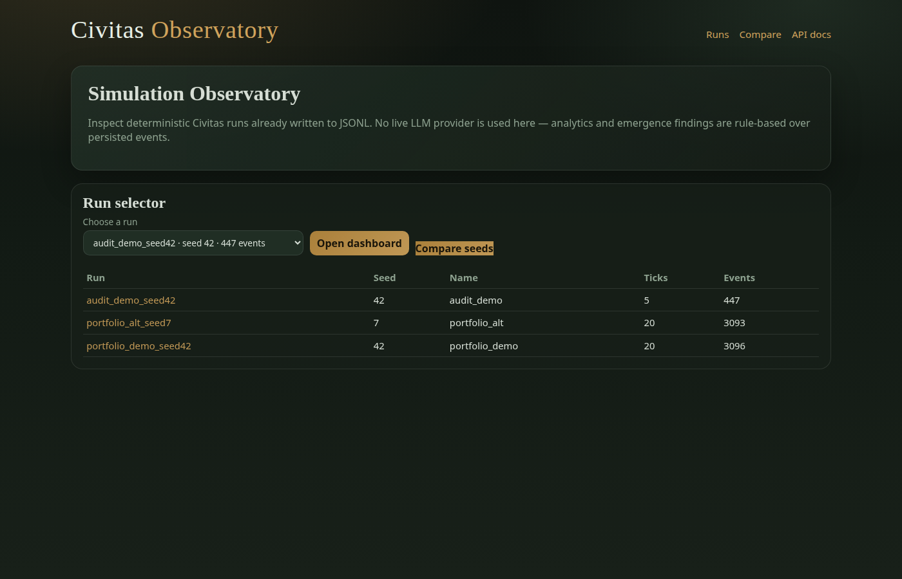
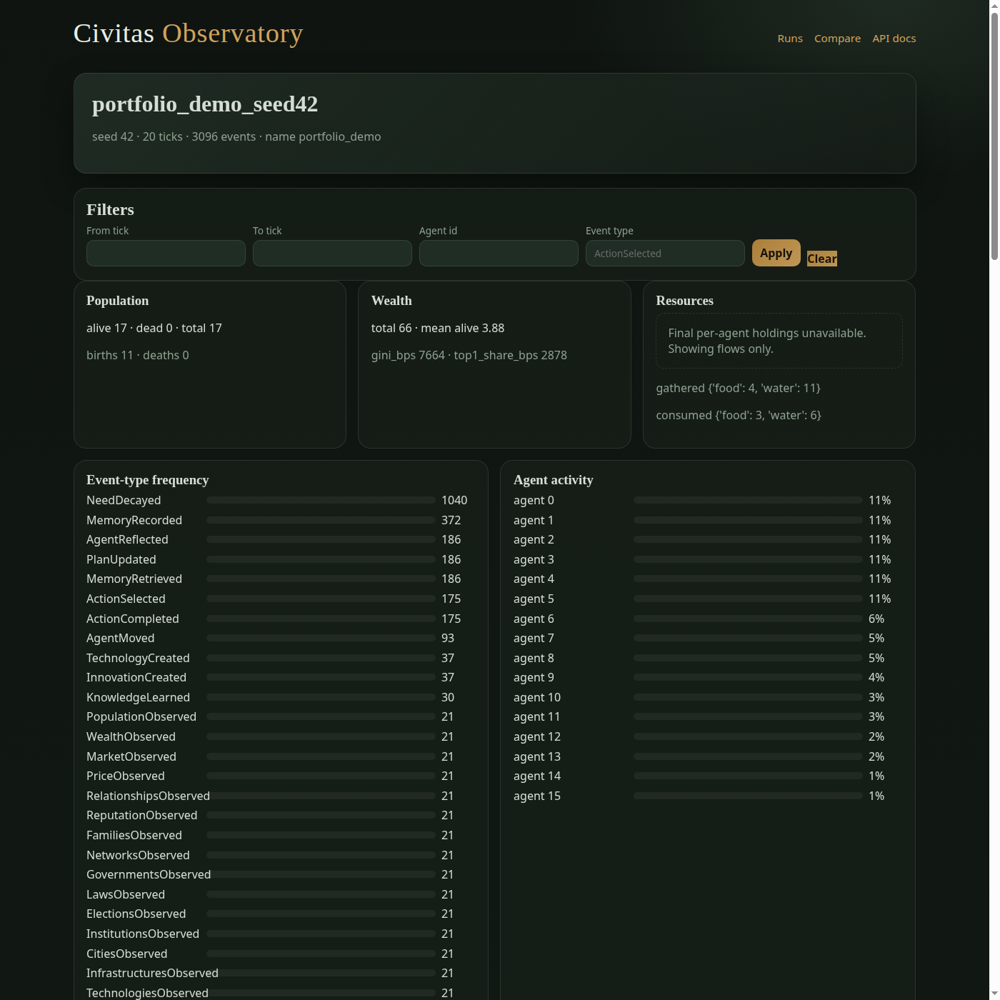
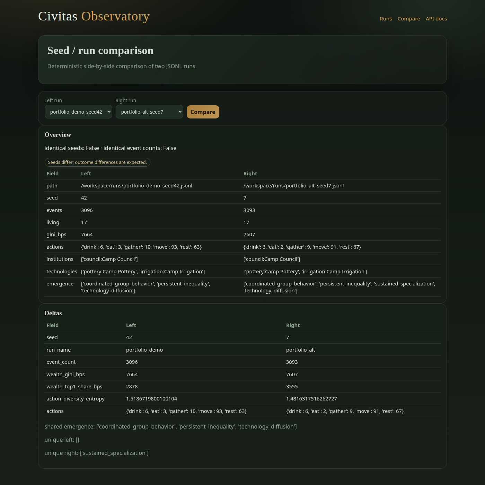

# Observatory

The Simulation Observatory is a **read-only** research surface over completed JSONL runs: FastAPI JSON API plus a Jinja2 UI.

## Install & run

```bash
pip install -e ".[observatory]"
export CIVITAS_RUNS_DIR=/path/to/runs   # directory of *.jsonl
civitas serve --host 127.0.0.1 --port 8765
```

Open `http://127.0.0.1:8765/ui/`.

## UI routes

| Path | Purpose |
|------|---------|
| `/ui/` | Home — list runs under `CIVITAS_RUNS_DIR` |
| `/ui/runs/{run_id}` | Run detail — summary, metrics, emergence |
| `/ui/compare` | Side-by-side seed / run comparison |

Static assets live in `civitas/observatory/static/`; templates in `civitas/observatory/templates/`.

## API (selected)

| Method | Path | Purpose |
|--------|------|---------|
| `GET` | `/health` | Liveness |
| `GET` | `/runs` | List run ids |
| `GET` | `/runs/{run_id}` | Run summary |
| `GET` | `/runs/{run_id}/metrics` | Analytics |
| `GET` | `/runs/{run_id}/emergence` | Emergence findings |
| `GET` | `/compare` | Compare two runs (`a`, `b` query params) |

OpenAPI: `/docs` when the server is running.

## Screenshots

Real captures from local demo runs (Phase 21 Milestone 10):







## Limits

- Read-only: cannot start or mutate simulations through the UI.
- Run ids are file basenames; paths stay on the server filesystem.
- Final inventories are not reconstructed (see [EVENT_MODEL.md](EVENT_MODEL.md)).
