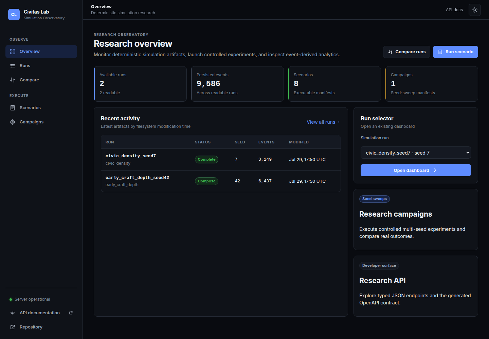
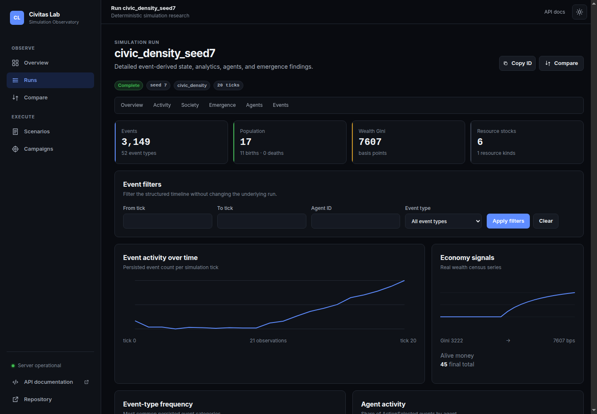
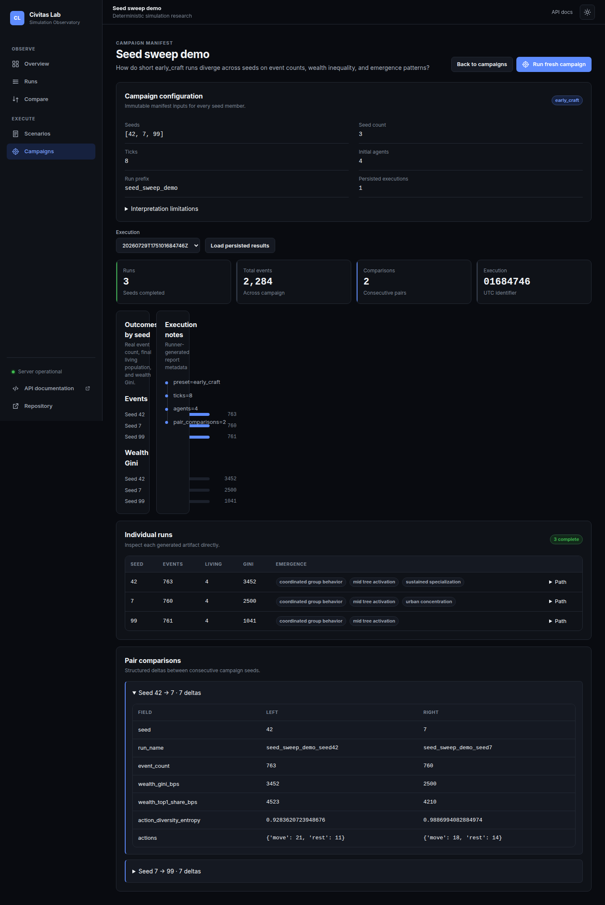
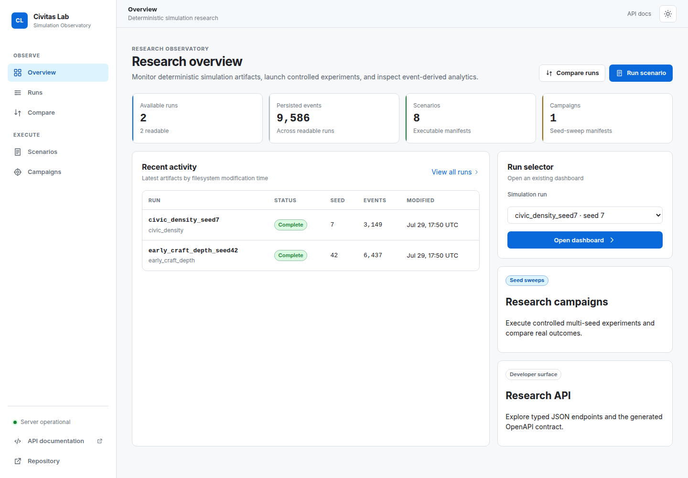

# Observatory

The Simulation Observatory is a local research surface: FastAPI JSON API plus
a Jinja2 UI. Existing JSONL logs are immutable; scoped scenario/campaign
actions may create new artifacts under `CIVITAS_RUNS_DIR`.

## Install & run

```bash
pip install -e ".[observatory]"
export CIVITAS_RUNS_DIR=/path/to/runs   # directory of *.jsonl
civitas serve --host 127.0.0.1 --port 8000
```

Open `http://127.0.0.1:8000/ui/`.

## UI routes

| Path | Purpose |
|------|---------|
| `/ui/` | Research overview and recent activity |
| `/ui/runs` | Searchable/sortable run catalog |
| `/ui/runs/{run_id}` | Run detail — summary, metrics, emergence |
| `/ui/compare` | Side-by-side seed / run comparison |
| `/ui/scenarios` | List and launch scenario manifests |
| `/ui/campaigns` | Launch seed sweeps and view persisted aggregates |

The desktop UI uses a persistent research sidebar; tablet/mobile use an
accessible drawer. Dark mode is default and the header theme control persists
an optional light theme. Static assets live in
`civitas/observatory/static/`; templates and shared macros live in
`civitas/observatory/templates/`.

## API (selected)

| Method | Path | Purpose |
|--------|------|---------|
| `GET` | `/health` | Liveness |
| `GET` | `/runs` | List run ids |
| `GET` | `/runs/{run_id}` | Run summary |
| `GET` | `/runs/{run_id}/metrics` | Analytics |
| `GET` | `/runs/{run_id}/emergence` | Emergence findings |
| `GET` | `/compare` | Compare two runs (`a`, `b` query params) |
| `GET/POST` | `/scenarios`, `/scenarios/{id}/run` | List / launch scenarios |
| `GET/POST` | `/campaigns`, `/campaigns/{id}/run` | List / launch campaigns |
| `GET` | `/campaigns/{id}/results` | Latest persisted campaign aggregate |

OpenAPI: `/docs` when the server is running.

## Screenshots

Current production-dashboard redesign:









UI architecture and redesign decisions:
[`OBSERVATORY_UI_ARCHITECTURE.md`](OBSERVATORY_UI_ARCHITECTURE.md).

## Limits

- Existing JSONL logs cannot be edited or deleted; launch actions only create
  fresh timestamped artifacts under the configured runs directory.
- Run ids are file basenames; paths stay on the server filesystem.
- Final inventories come from `ResourcesObserved` censuses when present.
