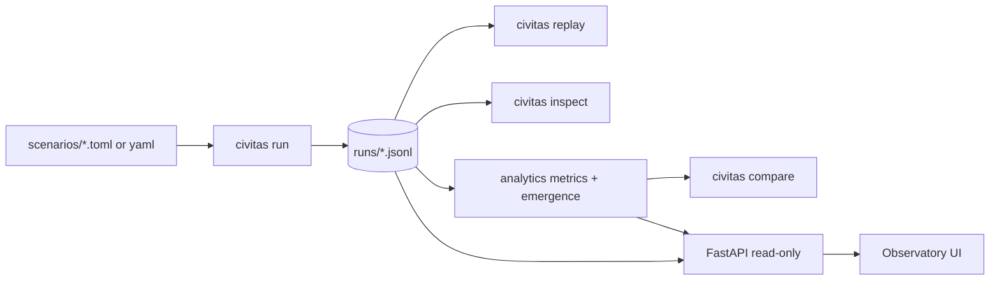

# Phase 21 — Simulation Observatory and Emergence Analytics

**Status:** Design approved for sequential milestone delivery  
**Constraint:** No new domain catalogs (resources, institutions, technologies, laws, cities)  
**Base revision:** `main` @ Phase 20 complete (`ebc00ea`)  
**Primary objective:** Make the existing simulation observable, demonstrable, measurable, and portfolio-ready.

---

## 1. Problem statement

Civitas Lab already has a deep deterministic engine and event log, but the operator surface is CLI-only (`version`, `run`, `config`). Analytics is a stub. Replay exists only as a library API (`JsonlEventStore`). A recruiter or researcher cannot easily inspect runs, compare seeds, or see quantitative emergence signals without writing ad-hoc Python.

Phase 21 builds an **observatory layer** on top of existing events and systems—without expanding civilization catalogs.

---

## 2. Confirmed architecture (pre-design inventory)

### Event schema

- Every persisted line is `DomainEvent.to_record()` JSON with sorted keys.
- Deserialization: `event_from_record` via `EVENT_TYPE_REGISTRY` keyed by concrete class name (`SimulationStarted`, `ActionSelected`, …).
- **65 concrete event types** currently registered (lifecycle, actions, resources, economy, social, governance, tech, cognition, observations).
- Contiguous `sequence` starting at 0 is validated by `JsonlEventStore.read_all`.
- There is **no separate event-version field** today; unknown `event_type` strings fail decode with `ValueError`.

### Run artifacts

- Default path: `runs/<name>_seed<seed>.jsonl` (gitignored).
- Bootstrap metadata is in `SimulationStarted` (`seed`, `ticks`, `agent_count`, `run_name`).
- Terminal marker: `SimulationCompleted` (`ticks_executed`).

### Layer rules (must preserve)

1. `domain` has no outward Civitas dependencies.
2. `systems` must not import each other.
3. `storage` / `analytics` read event streams; they do not own tick policy.
4. `cli` remains a thin adapter.
5. New API/UI adapters sit **outside** domain/systems (new `api/` and `observatory/` packages), depending on storage + analytics only.

### What is *not* supported today

- Full world rehydration projector (events → complete `World` aggregate) is **not** implemented as a first-class engine API.
- Real LLM providers (mock/null only).
- HTTP API / UI.
- Cross-run comparison tooling.

---

## 3. Target architecture (Phase 21)

```text
cli ──► engine/systems/domain     (unchanged simulation path)
cli ──► storage                   (run / replay / inspect)
cli ──► analytics                 (metrics, emergence, compare)
api ──► storage + analytics       (read-only FastAPI)
observatory ──► api or analytics  (local UI; templates + light JS preferred)
```



---

## 4. Architectural decisions

| ID | Decision | Rationale |
|---|---|---|
| AD-1 | **No catalog expansion** in Phase 21 | Audit found breadth already exceeds default-run depth; focus on observability. |
| AD-2 | **Analytics is offline over JSONL** | Matches existing storage; keeps tick loop free of metrics side effects. |
| AD-3 | **Metrics must be event-derivable** | If a quantity is not in events (or reconstructible summaries), do not claim it. |
| AD-4 | **Partial state from events, not invented full replay-world** | M2/M3 may reconstruct *summaries* from `*Observed`, `*Created`, spawn/death/action events. Full `World` rebuild is out of scope unless a pure projector can be added without changing tick semantics; if added later, it must be deterministic and tested. |
| AD-5 | **UI choice B: FastAPI + server-rendered templates + light JS** | Smallest maintainable fit for a Python research repo; avoid React toolchain unless templates prove inadequate. Revisit only if M7 acceptance fails. |
| AD-6 | **One PR per milestone** | Explicit process requirement; keeps reviewable diffs. |
| AD-7 | **Optional deps for API/UI** | Add `fastapi`, `uvicorn`, `httpx` (tests) under `[project.optional-dependencies]` extras such as `observatory` / `dev`, so core sim install stays lean. |
| AD-8 | **Emergence = explicit rules over metrics** | No LLM explanations; each pattern has named rule, thresholds, evidence bundle, deterministic score. |
| AD-9 | **Scenarios are data, not engine forks** | Store configs/questions under `scenarios/`; engine remains unchanged. |
| AD-10 | **Honest docs** | Do not claim real AI/LLM/ML validation; describe mock cognition accurately. |

---

## 5. Risks

| Risk | Impact | Mitigation |
|---|---|---|
| Observation events are periodic snapshots, not complete ledgers | Some metrics sparse or approximate | Document input requirements; mark unavailable fields in UI/API |
| No full world projector | “Final-state reconstruction” limited | Derive final *summaries* from last observations + lifecycle events; do not fake inventories |
| Large JSONL files | API/UI latency | Stream/paginate events; cache parsed summaries in memory per process only |
| Format-only churn in catalog files (M1) | Noisy diffs | Format-only PR; no logic edits |
| Metric misuse labeled as “emergence” | Scientific credibility | Strict definitions + tests; avoid vanity metrics |
| Template UI too plain for portfolio | Weak demo | Focus on clarity, real charts from real series, screenshots in M10 |
| Dependency creep | Install weight | Keep FastAPI behind optional extra until M6 |

---

## 6. Milestone plan and acceptance criteria

### M1 — Repository quality repair (this PR)

**Deliverables**

- `ruff format` applied so `ruff format --check .` (and `src tests`) pass
- `pyproject.toml` repository URLs corrected to `jponnam/Project-Genesis`
- README quality/CLI notes corrected only where inaccurate
- `docs/PHASE_21_DESIGN.md` (this document)

**Acceptance**

- [ ] `pytest` passes
- [ ] `ruff check src tests` passes
- [ ] `ruff format --check .` passes
- [ ] `mypy` passes
- [ ] No simulation behavior changes

### M2 — Replay CLI

**Deliverables:** `civitas replay PATH` with summary/filter/tick/agent/type options; helpful errors; tests.

**Acceptance:** Uses `JsonlEventStore` + existing schema; no unsupported world rebuild claims; comprehensive CLI tests.

### M3 — Inspect / summary CLI

**Deliverables:** `civitas inspect PATH` Rich summary + `--format json`; only event-derivable fields; tests.

### M4 — Analytics engine

**Deliverables:** Real `civitas.analytics` metrics with definitions, empty/degenerate handling, deterministic tests. Only valid metrics for current events.

### M5 — Emergence detection

**Deliverables:** Rule-based detector with name, score, evidence, time range, entities, explanation, metric inputs; controlled-sequence tests.

### M6 — Local research API

**Deliverables:** FastAPI read-only endpoints listed in phase brief; pagination; OpenAPI; TestClient tests; no file mutation.

### M7 — Interactive observatory

**Deliverables:** Local UI (templates+JS preferred) covering run select, dashboard, timeline, agents, distributions, freqs, institutions/cities/tech, emergence, seed compare, filters; unavailable data labeled.

### M8 — Seed comparison

**Deliverables:** `civitas compare RUN_A RUN_B` (+ API/UI); deterministic comparison tests.

### M9 — Demonstration scenarios

**Deliverables:** Scenario configs + docs (questions, commands, signals, limitations); no engine hard-coding.

### M10 — Portfolio documentation

**Deliverables:** README + architecture/event/analytics/emergence/observatory/reproducibility/demo guides; honest capability list; real screenshots.

---

## 7. Metrics candidacy (M4 preview — only if event-supported)

| Candidate | Likely sources | Notes |
|---|---|---|
| Event frequency by type/tick | all events | Always valid |
| Agent activity distribution | `ActionSelected` / `ActionCompleted` | Valid |
| Wealth inequality (Gini) | `WealthObserved` money vectors / transfers | Use observation snapshots; document |
| Resource inequality | inventories via gather/consume/produce/trade if reconstructible | Only if reconstruction is sound; else skip or mark partial |
| Birth/mortality rates | `AgentBorn`, `AgentDied`, `PopulationObserved` | Valid |
| Action diversity / entropy | action histograms | Valid |
| Tech adoption | `TechnologyDiscovered`, `KnowledgeLearned` | Valid; default runs often fire-only |
| Institution/city formation | `InstitutionCreated`, `CityCreated` | Sparse after bootstrap |
| Trade / relationship density | `ResourceTraded`, `RelationshipUpdated`, network observations | Valid with caveats |
| Stability vs volatility | tick-to-tick metric deltas | Define precisely |

Any candidate that cannot be derived honestly will be **omitted**, not fabricated.

---

## 8. Verification commands (every milestone)

```bash
source .venv/bin/activate
pytest
ruff check src tests
ruff format --check .
mypy
```

---

## 9. Out of scope (Phase 21)

- New `TechnologyKind` / `LawKind` / `InstitutionKind` / `InfrastructureKind` / `CityKind` values
- PostgreSQL, Redis, Celery, Ray, Temporal
- Real LLM provider integration
- Merging directly to `main`
- Implementing M2–M10 in the same continuous run as M1

---

## 10. Execution status

| Milestone | Status |
|---|---|
| Design document | Complete (this file) |
| M1 Quality repair | Merged |
| M2 Replay CLI | Merged |
| M3 Inspect CLI | Merged |
| M4 Analytics engine | Merged |
| M5 Emergence detection | Merged |
| M6 Research API | Merged |
| M7 Observatory UI | Merged |
| M8 Seed comparison | Merged |
| M9 Demo scenarios | Merged |
| M10 Portfolio docs | Complete (this PR) |
